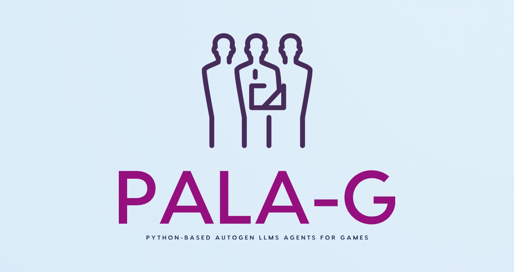

# Building the optimized solution by using the Python-based Autogen LLMs agents (PALA-G)



## About this package

This new solution will to evaluate the power of LLM Agents, which is created solutions as we progress & refined out prompt from scratch by using Sarvam AI & Python. This opens a brand new opportunities for IT companies & business start-ups, which is looking for delivering first solutions without the need to write lots of code & has better performance in comparison with GPT-4. This project is for the advanced Python, Open AI for data Science Newbie & AI evangelist.


## How to use this package

(The following instructions apply to Posix/bash. Windows users should check
[here](https://docs.python.org/3/library/venv.html).)

First, clone this repository and open a terminal inside the root folder.


Install the requirements:

```bash
pip install -r requirements.txt
```

Install the above requirements.

Create and activate a new virtual environment (recommended) for consumer application by running
the following:

```bash
python3 -m venv senv
source senv/bin/activate
```

Run the server, which will interact with Open AI & UpTrain server by invoking the specific APIs.

```bash
python buildYourApps.py
```

Please find the some of the important dependent package -

```
pip install autogen==0.3.1
pip install beautifulsoup4==4.12.3
pip install docker==7.1.0
pip install FLAML==2.3.1
pip install matplotlib==3.9.2
pip install multitasking==0.0.11
pip install numpy==1.26.4
pip install openai==1.52.2
pip install pandas==2.2.3
pip install peewee==3.17.7
pip install pillow==11.0.0
pip install pygame==2.6.1
pip install soupsieve==2.6
pip install tabulate==0.9.0

```

## Screenshots


## Resources

- To view the complete demo with sound, check out our [YouTube Page](https://youtu.be/jMERwsokd6Q).
- To view on Python, check out the [Python Page](https://docs.python.org/3/).
- To view on AutoGen agents, check out the [AutoGen Page](https://microsoft.github.io/autogen/0.2/docs/Getting-Started).
- To view on OpenAI agents, check out the [OpenAI Page](https://platform.openai.com/docs/api-reference/introduction).
